# Creating a Roxie Alexa Skill

# Table of Contents

# Introduction to the Roxie Alexa Skill

Since Alexa Skills Kit (ASK) utilizes Lex in order to determine and power intents for skills, porting Roxie to an Alexa skill is a fairly simple process. This guide will walk through the steps that need to be performed in order to export/import the Lex intents, create the wrapper Lambda function, and publish the Alexa skill to a subset of beta users. Requirements and configuration may change depending on decisions to publicly publish a skill within the Alexa Skills or the Alexa for Business directories.

Even though Alexa is powered by Lex, there are a number of limitations and differentiations as to how we set up the skill. For example, while Lex allows us to configure an endpoint (Lambda function) per intent, Alexa only supports one endpoint total. For this reason we need to build a wrapper Lambda function to act as our endpoint which will in turn call the individual Roxie Lambda functions within the Roxie use-case.  

The end to end workflow is as follows:

1. A users asks a question to Roxie via the Alexa skill invocation keyword.
1. Alexa Skills Kit (ASK) translates the utterances or spoken words to a given intent.
1. The intent request is sent to the wrapper Lambda function (ASK endpoint) for processing.
1. The wrapper Lambda function processes the intent name, calling the associated individual Lambda function within the Roxie use-case to fulfil the intent.
1. The individual function contains code used to query the Rubrik API and find an answer to our question.
1. The Rubrik API responds to the query and to the individual Lambda function. The function code then formats the message into something a bit more human friendly.
1. The friendly message is handed back to the wrapper Lambda function, where it is then further modified into a format which the Alexa Skill can read and sent to back to the Alexa Skills Kit.
1. The Alexa skill then returns the response to the user via spoken word.

# Prerequisites

The following are the prerequisites required in order to create and test the Roxie Alexa Skill

* Installation and configuration of a function Roxie Chatbot
* Access to the Alexa Developer Portal
* An Amazon Echo, Echo Dot, or Alexa supported device registered to an Amazon account

# Configuration

The following outlines the configuration process of creating an Alexa Skill around the Roxie use-case.

## Create an Alexa Skill

1. Log into the [Alexa Developer Console](https://developer.amazon.com/alexa/console/ask) and click `Create Skill` to create a new skill. Give the skill your desired name, selecting `Custom` as a model, and `Provision your own` for backend hosting. When finished, click `Create Skill`.
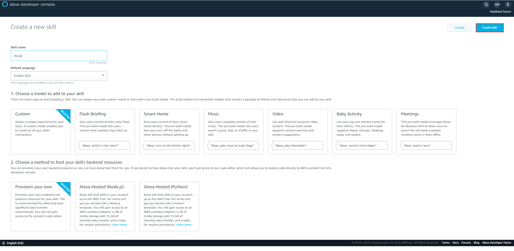
1. From the template selection screen, select `Start from scratch` and click `Choose`.
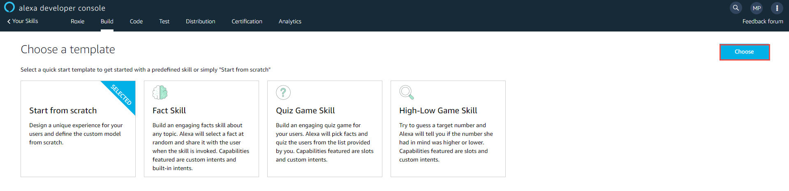
1. From the left hand navigational menu, select `Interaction Model` -> `Intents` -> `JSON Editor`. Drag and drop [this file](../ask/intents.json) containing the Roxie intents into the JSON editor and click `Save Model`
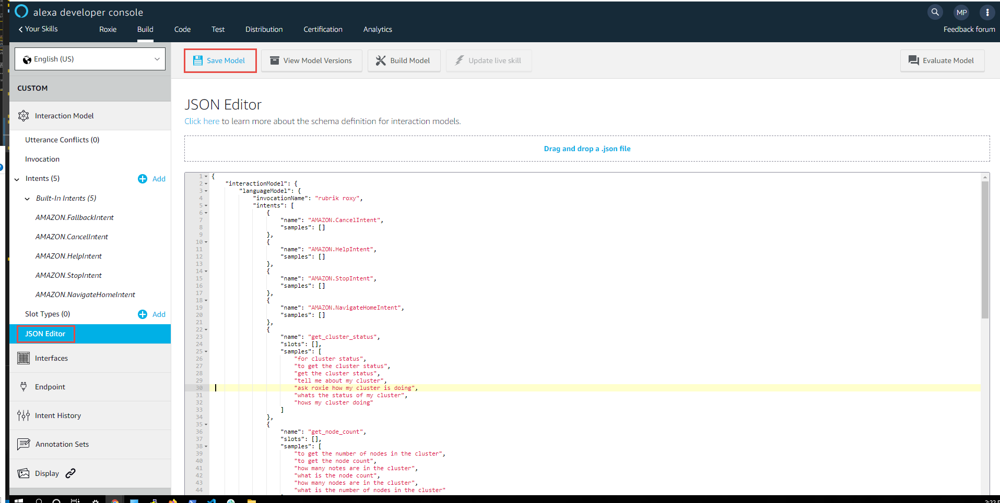
**Note - The names of the intents must be an exact match with the names of the individual Lambda functions setup within your Roxie bot. The wrapper function created later will execute these individual functions based on the intent name. For example, if you have an intent named *get_cluster_status* an associated Lambda function must exist named *get_cluster_status*.**
1. From the left hand navigation within the build section, select `Interaction Model` -> `Invocation`. Here we need to define an invocation name for our skill. This will be the words spoken to Alexa to invoke our skill (IE Alexa, Open Rubrik Roxy). By default, `rubrik roxy` will be used from the imported JSON in the previous step however feel free to modify this to your preference. **Note - if using roxy it must be spelt with a *y* in order for Alexa to understand the pronunciation of the word.**
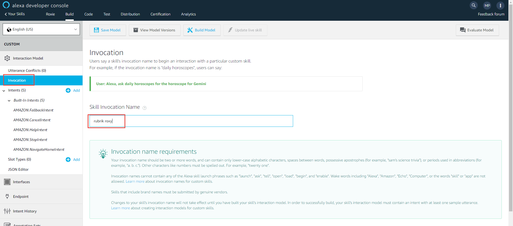

With intents and invocation configured we can now proceed to modify our IAM service role and create the wrapper Lambda function.  

## Modify IAM service role used by Roxie

In order for our wrapper Lambda function to execute the individual Lambda functions within the Roxie use-case we will need to grant the proper permissions through AWS IAM. The following outlines the process of adding the required permissions to the `roxie_lambda` role created during the initial configuration of the Roxie use-case.

1. Log into the AWS Console and select the IAM service.
1. Select `Access management` -> `Roles` from the left hand navigational menu. Click the role which was created for the roxie use-case.
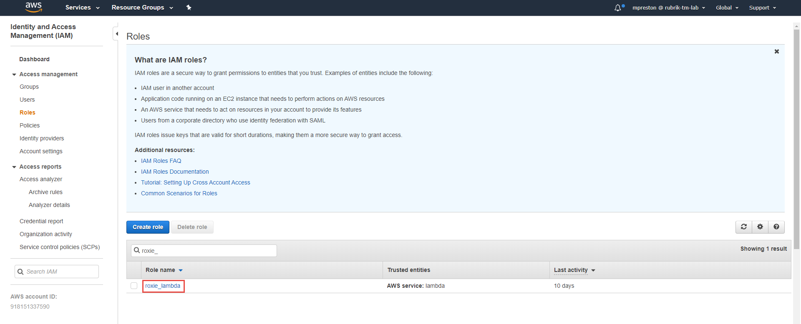
1. From the Summary page click `Attach policies`.
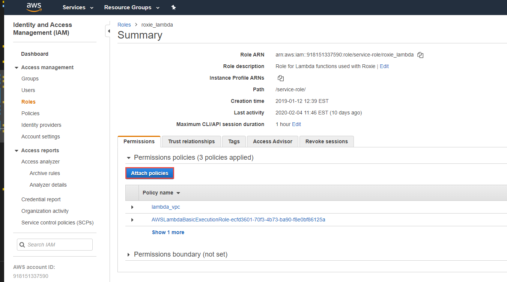
1. Find the `AWSLambdaRole` policy, select the checkbox, and click `Attach policy`.
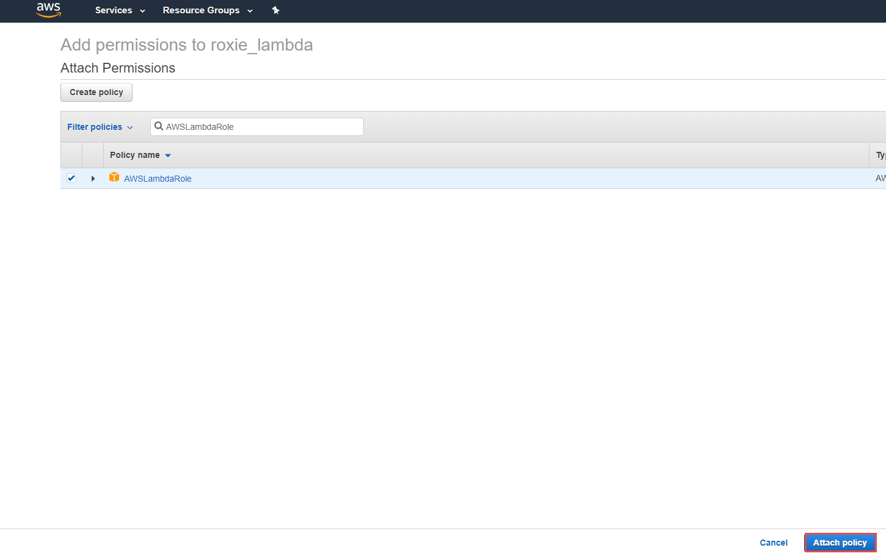

The service role now has the required permissions to execute Lambda functions.

## Create a wrapper Lambda Function

1. Log into the AWS Console and select the Lambda service and select 'Create function'.
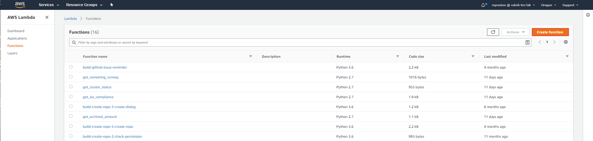
1. Select `Author from scratch`. Give the function a name, select Python 3.X as the runtime language. Select to `Use and existing role` as the execution role and select the IAM role which was modified above and click `Create function`.
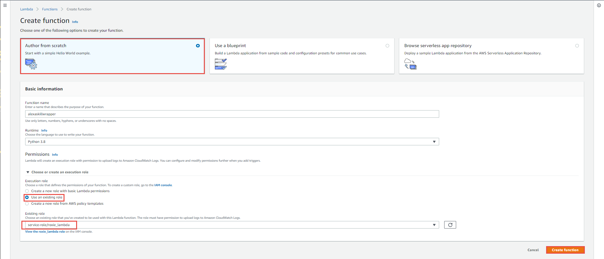
1. Within the designer section, select `Add trigger`. From the trigger selection dialog, select `Alexa Skills Kit`.  Ensure `Skill ID Verification` is enabled and input the skill id of the newly created Alexa Skill and click `Add`.
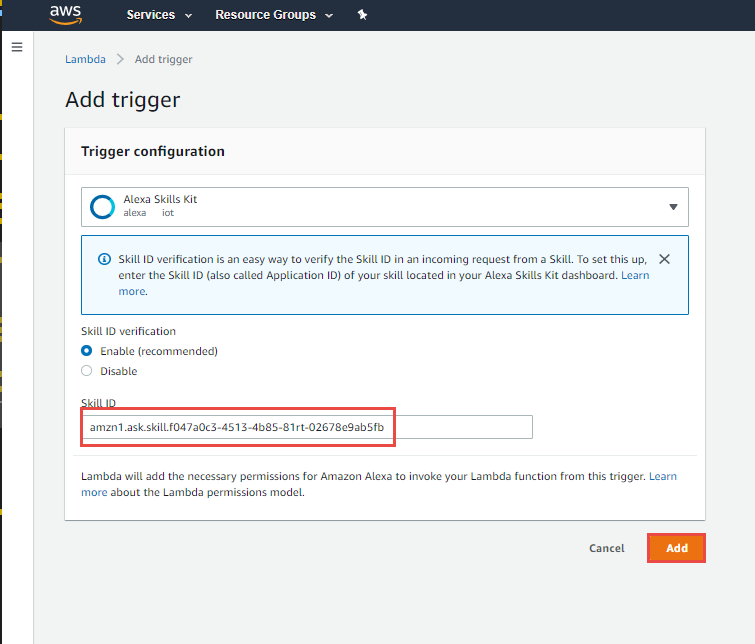
**Note - The Alexa Skill ID can be found by selecting `View Skill Id` on the listing of your Alexa skills within the Alexa Developer Console.**
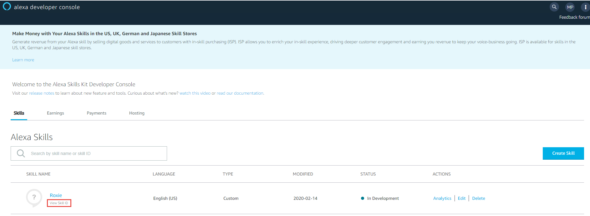
1. Copy the code from [this file](../ask/roxie_alexa_skill_wrapper.py) to the inline editor within the function and select `Save`.

## Associate wrapper Lambda function ARN with Alexa Skill

1. Log into the Alexa Developer Console and select the previously created Alexa skill.
1. From the left hand navigational menu, select `Endpoint`. Select `Amazon Lambda ARN` as the Service Endpoint Type, paste the ARN of the previously created wrapper function into the Default Region input box, and click `Save Endpoints`.
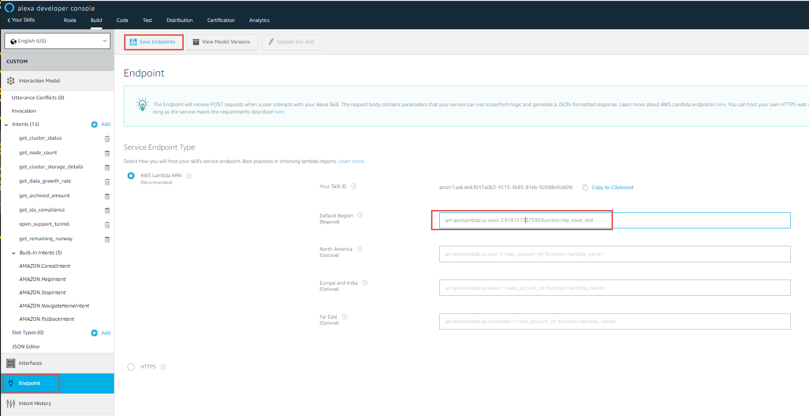
**Note - The ARN for the wrapper Lambda function can be found within the Lambda function in the top right hand side of the screen.**
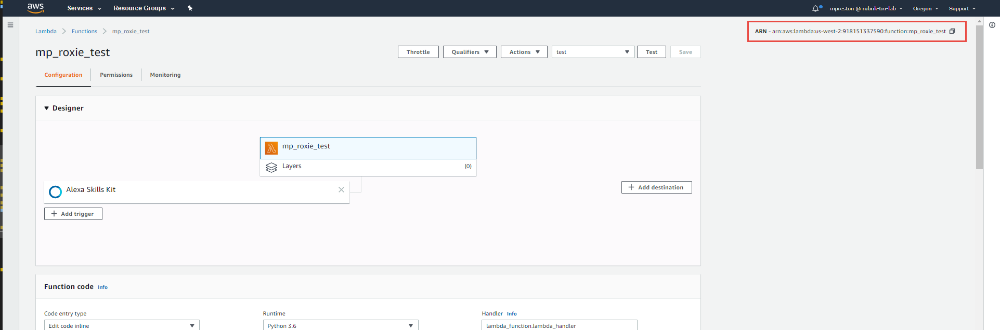
1. From the left hand navigational menu select `Intents` and click `Save Model`. Once saved, click `Build Model`

## Testing the Alexa Skill before publishing

1. Select `Test` from the top navigational menu to begin testing our skill.  Select `Development` from the Skill testing dropdown.

1. We can now begin to test our intents by sending input into the testing input box. IE Ask Rubrik Roxy how my cluster is doing should run the get_cluster_status function and return content.
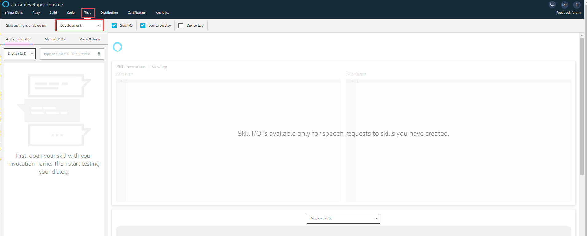
`
## Publish the Alexa skill and associate beta user(s)

Once all functions and intents are working properly we can publish and invite users to test our skill.

1. Select `Distribution` from the top navigation menu and fill out all of the required fields (Name/One Sentence Description, Detailed Description, Example Phrases, Icons and Category). Click `Save and continue`
1. Answer the Privacy & Compliance questions and click `Save and Continue`
1. Within the `Availability` dialog select `Public` as the skill access and click `Save and Continue` **Note - We will come back to this page to enable the beta access as the skill must pass verification before that can happen - It won't actually be public**
1. Validation will begin automatically. Once a valid certification has been obtained, navigate back to the `Availability` section of the Skill distribution.  Enable the Beta Access and invite the Amazon Alexa accounts you wish to have access to the skill
1. Begin chatting with your Rubrik cluster :)